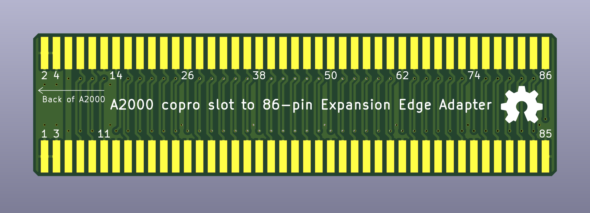
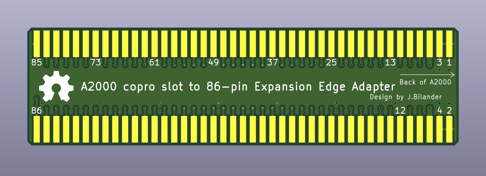
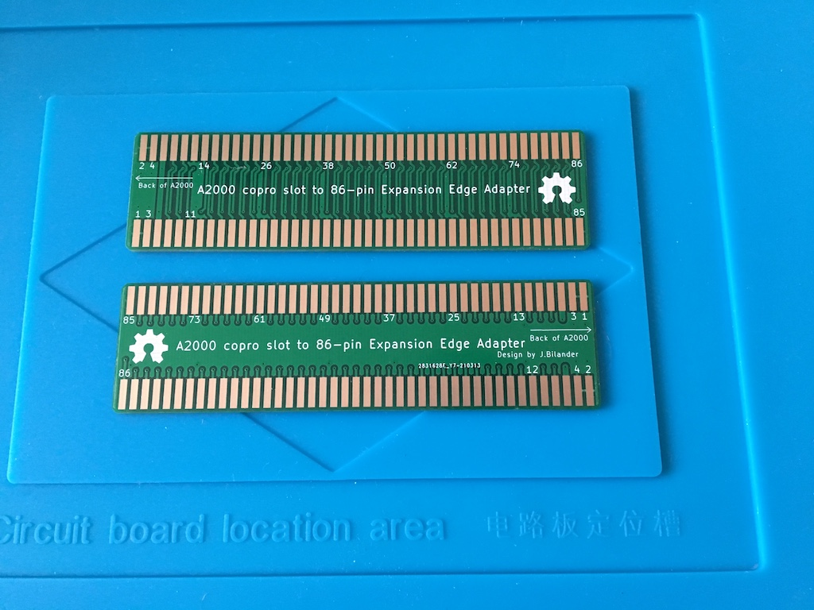
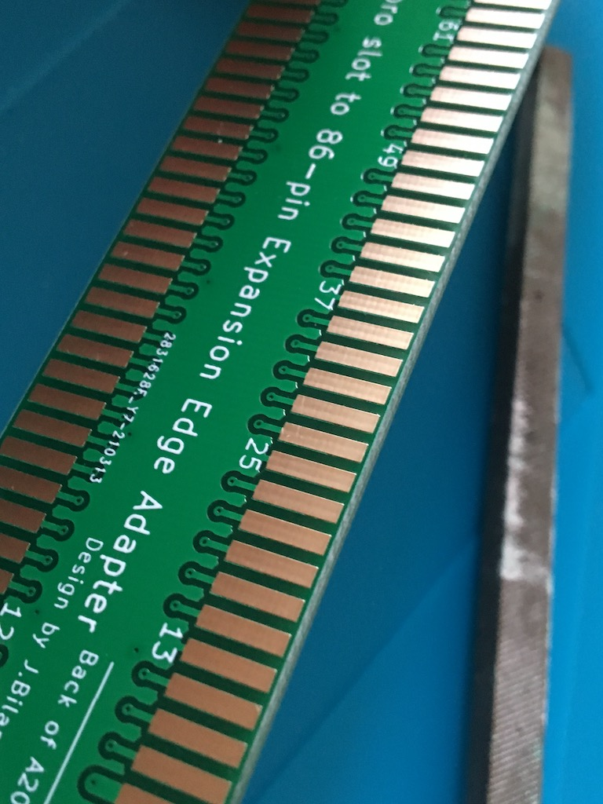
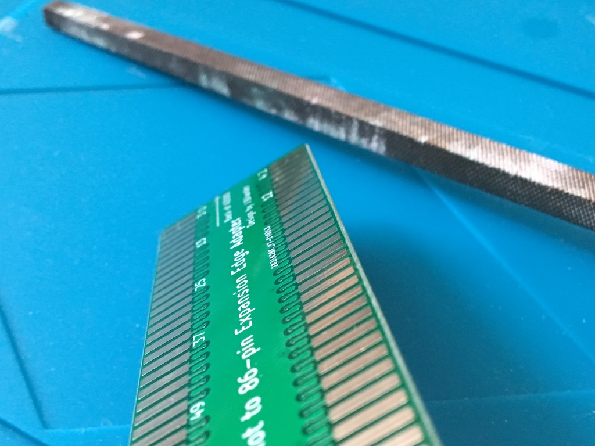

# A2000 Twisted Sister

A2000 Co-processor slot adapter. Lets you plug a regular A500 sidecar accelerator into an A2000

### Still UNTESTED in A2000 !!!

Please report back to me if you successfully used this adapter in a A2000. I have a few spare PCBs available.
 email: jorgen.bilander at gmail.com
 
Verified working ok with an Amiga Action Replay cartridge in A2000 (tested by LIV2)

***

Please double check that your E-CLK is not generated from two places, co-pro slot and CPU slot, as that most likely will damage your card and/or CPU. Accelerators like the ACA500+ normally has a jumper for this setting:   
http://eab.abime.net/showpost.php?p=1195977&postcount=569

***

 

***

 

***

## Manually chamfering edges 45°

[![CC BY-SA 4.0][cc-by-sa-shield]][cc-by-sa]

This work is licensed under a
[Creative Commons Attribution-ShareAlike 4.0 International License][cc-by-sa].

[![CC BY-SA 4.0][cc-by-sa-image]][cc-by-sa]

[cc-by-sa]: http://creativecommons.org/licenses/by-sa/4.0/
[cc-by-sa-image]: https://licensebuttons.net/l/by-sa/4.0/88x31.png
[cc-by-sa-shield]: https://img.shields.io/badge/License-CC%20BY--SA%204.0-lightgrey.svg
